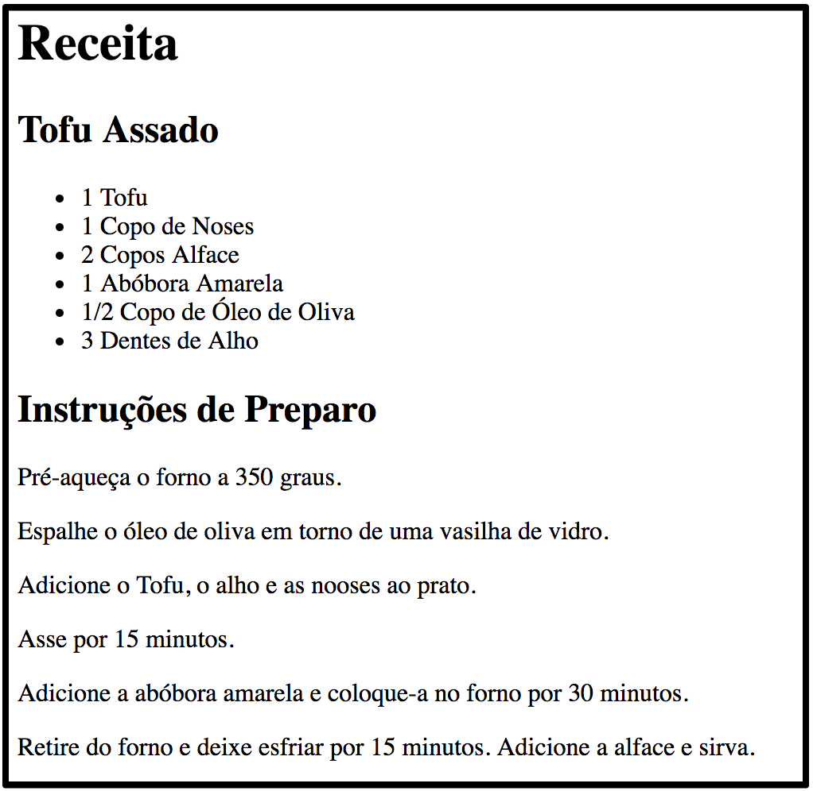

# Introdução ao HTML

Nesta atividade vamos implementar uma página que mostra uma receita de Tofu.

As bibliotecas usadas são importadas no arquivo `index.html` e o código javascript, se necessário, no arquivo `index.js`.

### :framed_picture: Objetivo

A imagem abaixo mostra o resultado final esperado:

